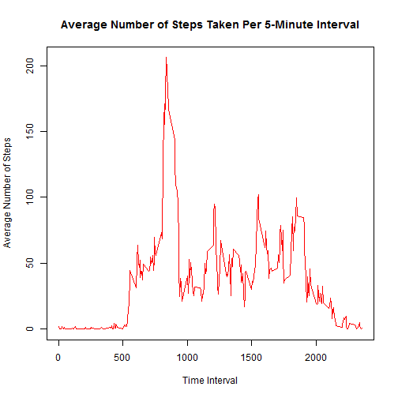

Reproducible Research Project 1 
================================

#**Introduction**

Using devices such as Jawbone Up, Nike FuelBand and Fitbit now provides large amount of data about personal activity. This project makes use of data from a personal activity monitoring device. It collected data from an anonymous individual during the months of October and November 2012, whcih included the number of steps taken in 5 minute intervals each day. 

The dataset is stored in a comma-separated-value (CSV) file and there are a total of 17,568 observations in this dataset. The variables included in this dataset are:
steps: Number of steps taking in a 5-minute interval (missing values are coded as NA)
date: The date on which the measurement was taken in YYYY-MM-DD format
interval: Identifier for the 5-minute interval in which measurement was taken


#**Assignment**

##**Loading and preprocessing the data**

```r
# Load required Libraries
        library(dplyr)
        library(lattice)
```


```r
# Read the dataset
        activityData<-read.csv("activity.csv")

# Show the dimension of the complete dataset
        dim(activityData)
```

```
## [1] 17568     3
```

```r
# Remove "NA" from the dataset
        naRemove<- na.omit(activityData)

# Show the dimension of the "NA"-removed dataset
        dim(naRemove)
```

```
## [1] 15264     3
```

The original dataset contains 17568 observations and 3 features. After removing the rows that contain "NA", the number of observations in the newly created dataset reduced to 15264. 


##**What is mean total number of steps taken per day?**

For this part of the assignment, the missing values in the dataset can be ignored.

###**Calculate the total number of steps taken per day**

```r
# Calculate the total number of steps taken per day
        stepCount<-aggregate(steps ~ date, data=naRemove, sum)
```

###**Calculate and report the mean and median of the total number of steps taken per day**

```r
# Calculate the mean of the total number of steps taken per day
        meanDailyStep<-mean(stepCount$steps)
        meanDailyStep
```

```
## [1] 10766.19
```

```r
# Calculate the median of the total number of steps taken per day
        medianDailyStep<-median(stepCount$steps)
        medianDailyStep
```

```
## [1] 10765
```

###**Make a histogram of the total number of steps taken per day**

```r
# Create a histogram of the total number of steps taken per day
        hist(stepCount$steps, xlab = "Total Number of Steps Taken Per Day", 
             main = "Histogram of Total Number of Steps Taken Per Day", col = "blue")
             abline(v = medianDailyStep, col="yellow") # show the median as a yellow vertical line
             abline(v = meanDailyStep, col="red") # show the mean as a red vertical line
```

 

The mean of the total number of steps taken per day is 10766.19 and the median is 10765. Since these two values are very close to each other, they overlap on the histogram plot. 


##**What is the average daily activity pattern?**

###**Make a time series plot of the 5-minute interval (x-axis) and the average number of steps taken, averaged across all days (y-axis)**

```r
# Calculate the mean number of steps taken per 5-minute interval
        stepsPerInterval<-aggregate(steps ~ interval, data=naRemove, FUN=function(x) mean(x))

# Create a time series plot showing the average number of steps taken per 5-minute interval
        plot.ts(stepsPerInterval$interval,stepsPerInterval$steps, type = "l", col="red", xlab="Time Interval",
                ylab="Average Number of Steps", main="Average Number of Steps Taken Per 5-Minute Interval")
```

 

###**Which 5-minute interval, on average across all the days in the dataset, contains the maximum number of steps?**

```r
# Sort the dataset from the greatest number of steps per 5-minute interval to the lowest
        sorted<-arrange(stepsPerInterval, desc(steps))

# Show the 5-minute interval that contains the maximum number of steps
        maxStepsCount<-sorted[1,]
        maxStepsCount
```

```
##   interval    steps
## 1      835 206.1698
```

The 5-minute interval that contains the maximum number of steps is interval 835, which contains 206 steps.  


##**Imputing missing values**

There are a number of days/intervals with missing values (coded as NA). The presence of missing days may introduce bias into some calculations or summaries of the data.

###**Calculate and report the total number of missing values in the dataset** 
####*(i.e. the total number of rows with NA)*

```r
# Calculate the total number of rows containing NA in the original dataset
        NASubset<-subset(activityData, is.na(activityData$steps))

# Show the total number of rows containing NA in the original dataset
        NACount<-nrow(NASubset)
        NACount
```

```
## [1] 2304
```

There are 2304 rows contain NA in the original dataset. 

###**Devise a strategy for filling in all of the missing values in the dataset**                                  
####*The strategy does not need to be sophisticated. For example, you could use the mean/median for that day, or the mean for that 5-minute interval, etc.*

```r
# Merge the two subsets by their common "interval": one subset contains NA in each row and the other one does 
# not contain any NA and has been calculated the average number of steps taken per 5-minute interval. 
# These average number of steps taken per 5-minute interval ("steps.y") will be used for imputing the NA at the same time interval.     

        mergeddf<-merge(NASubset,stepsPerInterval, by.x = "interval", by.y="interval")

# Replace the variable name "steps.y" with "steps" in the merged dataset. This step is necessary for the 
# subsequent row binging of the two subsets. 

        names(mergeddf)<-sub("steps.y", "steps", names(mergeddf))
```
The average number of steps taken per 5-minute interval was used for imputing the NA at the same time interval.

###**Create a new dataset that is equal to the original dataset but with the missing data filled in**

```r
# Extract the variables "data", "interval" and the imputed step counts "steps" from the merged dataset 
# and make a new data frame
        imputeddf<-mergeddf[, c("steps", "date", "interval")]

# Combine the imputed NA-containing rows with the non-NA-containing rows
        completedf<-rbind(naRemove,imputeddf)

# Show the dimension of the combined dataset
        dim(completedf)
```

```
## [1] 17568     3
```

```r
# Show the number of NA in the combined dataset
        totalNACount<-sum(is.na(completedf$steps))
        totalNACount
```

```
## [1] 0
```

After imputing the missing values with the average number of steps taken at the same time intervals, the newly created dataset contains 17568 observations, which is the same as the original dataset. However, it contains no NA.  

###**Calculate and report the mean and median total number of steps taken per day. Do these values differ from the estimates from the first part of the assignment? What is the impact of imputing missing data on the estimates of the total daily number of steps?**

###**Calculate the total number of steps taken per day with the imputed dataset**

```r
# Calculate the total number of steps taken per day with the imputed dataset
        stepImputed<-aggregate(steps ~ date, data=completedf, sum)
```

###**Calculate and report the mean and median of the total number of steps taken per day with the imputed dataset**

```r
# Calculate the mean of the total number of steps taken per day with the imputed dataset
        meanStepImputed<-mean(stepImputed$steps)
        meanStepImputed
```

```
## [1] 10766.19
```

```r
# Calculate the median of the total number of steps taken per day with the imputed dataset
        medianStepImputed<-median(stepImputed$steps)
        medianStepImputed
```

```
## [1] 10766.19
```

###**Create a histogram of the total number of steps taken per day with the imputed dataset**

```r
# Histogram of the total number of steps taken each day with the imputed dataset
        hist(stepImputed$steps, xlab="Total Number of Steps Taken Per Day (Imputed)", 
             main = "Histogram of Total Number of Steps Taken Per Day (Imputed)", 
             col = "green")
             abline(v=medianStepImputed, col="yellow")
             abline(v=meanStepImputed, col="red")
```

 

```r
# Create a Histogram to show the difference between the total number of steps taken per day calculated from 
# non-imputed and imputed datasets 
             
# Histogram of total number of steps taken per day calculated from the imputed dataset
        hist(stepImputed$steps, main = paste("Histogram of Total Number of Steps Taken Per Day"), col="green",                        xlab="Total Number of Steps Taken Per Day")

# Histogram of total number of steps taken Per day calculated from non-imputed dataset
        hist(stepCount$steps, main = paste("Histogram of Total Number of Steps Taken Per Day"), col="blue",                      xlab="Total Number of Steps Taken Per Day", add=T)
        legend("topright", c("Imputed", "Non-imputed"), col=c("green", "blue"), lwd=10)
```

 

Both the mean and median of the total number of steps taken per day calculated from the imputed dataset are 10766.19, which is the same as the mean and slightly greater than the median calculated from the dataset without imputing. 


##**Is there any difference in activity patterns between weekdays and weekends?**

###**Create a new factor variable in the dataset with two levels - "weekday" and "weekend" indicating whether a given date is a weekday or weekend day**

```r
# Add a variable to the imputed dataset
        completedf$day<-factor("day")

# Convert the date to a Date variable
        completedf$date<-as.Date(as.character(completedf$date),format="%Y-%m-%d")

## Convert the date to weekday
        completedf$day<-weekdays(completedf$date, 2)

# Label the "day" variable as weekday if it belongs to "Mon", "Tue", "Wed", "Thr" or "Fri" 
# and label the "day" varialbe as weekend if it belongs to "Sat" or "Sun"
        for (i in (1: nrow(completedf))) {
                if(completedf$day[i] %in% "Sat" | completedf$day[i] %in% "Sun"){
                        completedf$day[i] = "weekend"
         } else {
                        completedf$day[i] = "weekday"      
                }
         }
```

###**Make a panel plot containing a time series plot of the 5-minute interval (x-axis) and the average number of steps taken, averaged across all weekday days or weekend days (y-axis)**

```r
# Calculate the average number of steps taken per 5-minute interval at weekday and weekend
        stepsPerInterval<-aggregate( steps ~ interval + day, data=completedf, FUN=function(x) mean(x))

# Make a panel time series plot showing the average number of steps taken per 5-minute interval during 
# weekday and weekend      
        xyplot(stepsPerInterval$steps ~ stepsPerInterval$interval | stepsPerInterval$day, 
               layout = c(1, 2), type = "l", 
               xlab = "Time Interval", ylab = "Average Number of Steps", 
               main="Average Number of Steps Taken Per 5 Minutes Interval")
```

 
